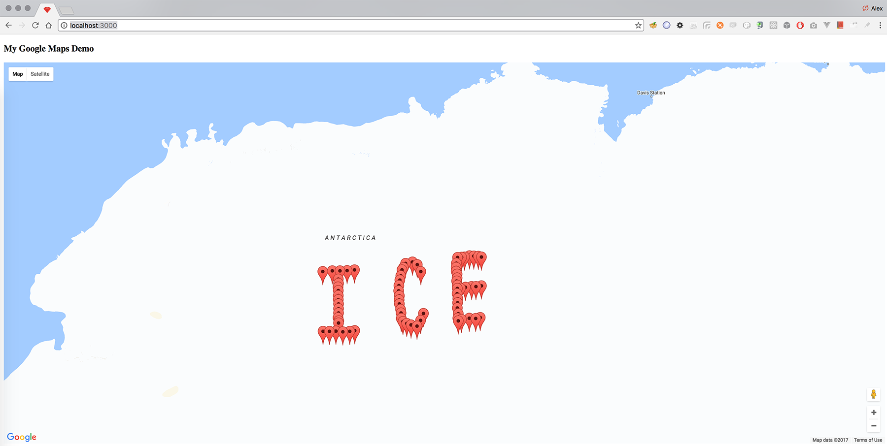

[SO Question: Add markers from rails database](https://stackoverflow.com/questions/45118406/add-markers-from-rails-database)

### Setup

First, go to [Google Maps API](https://developers.google.com/maps/documentation/javascript/get-api-key) documentation
and generate API-key.

Then:

```
bundle install
rake db:create db:migrate db:seed 
GOOGLE_MAPS_API='XXXXXXX-XXX-XXXXXXXXXXXXXXXXXXXXXXXXXXX' rails server
```


### Resources

[geoplaner.com](http://www.geoplaner.com/) - online tool to graphically create location points



